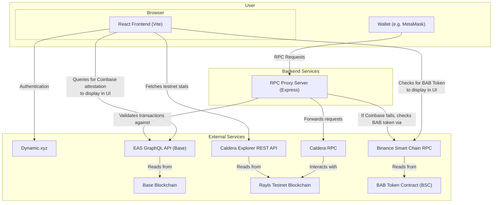

# Rayls Testnet DApp

**Official Production Builds:**
- **DApp**: [https://rayls-dapp-3nfhj.ondigitalocean.app/](https://rayls-dapp-3nfhj.ondigitalocean.app/)
- **Proxy RPC**: [https://rayls-dapp-3nfhj.ondigitalocean.app/rpc](https://rayls-dapp-3nfhj.ondigitalocean.app/rpc)

This project is a decentralized application (dApp) built for the Rayls Testnet. It provides a user-friendly interface for connecting a wallet, viewing onchain attestations, and interacting with the Rayls network.

The dApp features a custom RPC Proxy Server that acts as a gatekeeper for transactions. It checks for a specific onchain attestation (Coinbase Verified Account) before allowing any transactions to be sent to the network, while still permitting read-only requests like checking balances.

## Key Features

- **Wallet Integration**: Seamless wallet connection using [Dynamic.xyz](https://www.dynamic.xyz/).
- **Attestation-Gated Transactions**: A proxy server that only allows transactions from wallets with a valid Coinbase attestation.
- **Onchain Verification**: Users can view and verify their attestations directly on the EASSscan block explorer.
- **Modern Tech Stack**: Built with React, Vite, TypeScript, and Tailwind CSS.

## Technical Architecture



## Getting Started

### Prerequisites

- [Node.js](https://nodejs.org/) (version 18 or higher)
- [npm](https://www.npmjs.com/)

### Installation

1.  Clone the repository to your local machine:
    ```bash
    git clone https://github.com/AlexJupiter/rayls-dapp.git
    ```

2.  Navigate to the project directory:
    ```bash
    cd rayls-dapp
    ```

3.  Install the necessary dependencies:
    ```bash
    npm install
    ```

## Running the Application

This project consists of two main parts: the frontend dApp and the backend RPC proxy. You will need to run both in separate terminal windows to use the full application.

### 1. Running the Frontend DApp

The frontend is a Vite-powered React application. To start the development server:

```bash
npm run dev
```

The application will be available at `http://localhost:5173`. The server will automatically reload when you make changes to the code.

### 2. Running the RPC Proxy Server

The RPC Proxy is an Express server that handles requests to the blockchain. To start the proxy server:

```bash
npm run start:proxy
```

The proxy server will run on `http://localhost:3001/rpc`.

## Adding the Proxy to MetaMask

To use the attestation-gated transaction feature, you need to add the local proxy as a custom network in MetaMask.

1.  Open MetaMask and click on the network selection dropdown.
2.  Click **Add network** and then select **Add a network manually**.
3.  Fill in the network details:
    *   **Network Name**: Rayls Testnet Proxy (or any name you prefer)
    *   **New RPC URL**: `http://localhost:3001/rpc`
    *   **Chain ID**: 1632025
    *   **Currency Symbol**: ETH
    *   **Block Explorer URL**: `https://rayls-test-chain.explorer.caldera.xyz/`

Once added, MetaMask will send all requests for this network through your local proxy. You will be able to see your balance, but transactions will only succeed if your connected wallet has the required Coinbase attestation.
