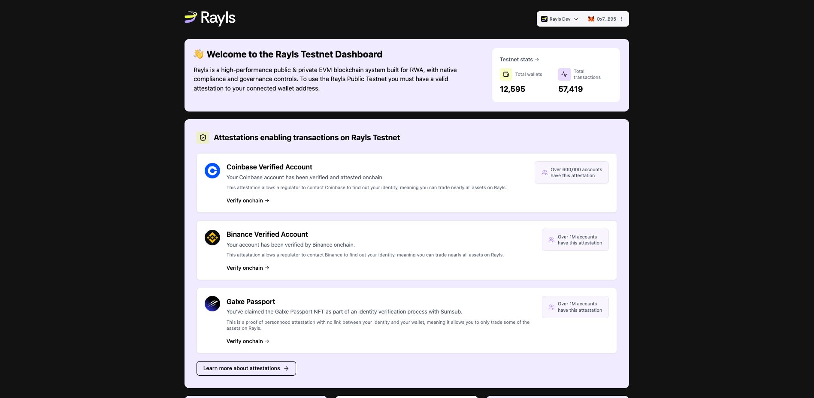
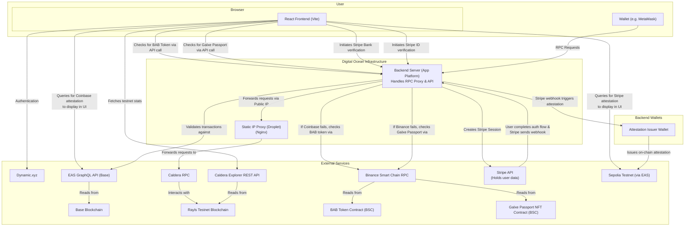

# Rayls Testnet DApp



**Official Production Builds:**
- **DApp**: [https://dapp.rayls.com/](https://dapp.rayls.com/)
- **Proxy RPC**: [https://dapp.rayls.com/rpc](https://dapp.rayls.com/rpc)

This project is a decentralized application (dApp) built for the Rayls Testnet. It provides a user-friendly interface for connecting a wallet, viewing onchain attestations, and interacting with the Rayls network.

The dApp features a custom RPC Proxy Server that acts as a gatekeeper for transactions. It checks for a specific onchain attestation (Coinbase Verified Account) before allowing any transactions to be sent to the network, while still permitting read-only requests like checking balances.

## Key Features

- **Wallet Integration**: Seamless wallet connection using [Dynamic.xyz](https://www.dynamic.xyz/).
- **Attestation-Gated Transactions**: A proxy server that only allows transactions from wallets with a valid Coinbase attestation.
- **Onchain Verification**: Users can view and verify their attestations directly on the EASSscan block explorer.
- **Modern Tech Stack**: Built with React, Vite, TypeScript, and Tailwind CSS.

## Technical Architecture

**Note:** The following diagram shows the current architecture. The final intended state is to place the Backend Server and the Static IP Proxy into a VPC for secure, private communication. This is pending a feature enablement from Digital Ocean support.



## Getting Started

### Prerequisites

- [Node.js](https://nodejs.org/) (version 18 or higher)
- [npm](https://www.npmjs.com/)

### Installation

1.  Clone the repository to your local machine:
    ```bash
    git clone https://github.com/AlexJupiter/rayls-dapp.git
    ```

2.  Navigate to the project directory:
    ```bash
    cd rayls-dapp
    ```

3.  Install the necessary dependencies:
    ```bash
    npm install
    ```

## Running the Application

This project runs as two separate processes for local development: the frontend development server and the backend server.

### 1. Running the Frontend DApp

The frontend is a Vite-powered React application. To start the development server, which provides features like Hot-Module-Replacement:

```bash
npm run dev
```

The application will be available at `http://localhost:5173` (or the next available port).

### 2. Running the Backend Server

The backend is an Express server that serves the API, proxies RPC requests, and will serve the static frontend files in production. To start the backend server:

```bash
npm start
```

The backend server will run on `http://localhost:8080`.

## Adding the Proxy to MetaMask

To use the attestation-gated transaction feature with your local development setup, you need to add the local backend server as a custom network in MetaMask.

1.  Open MetaMask and click on the network selection dropdown.
2.  Click **Add network** and then select **Add a network manually**.
3.  Fill in the network details:
    *   **Network Name**: Rayls Testnet (Local)
    *   **New RPC URL**: `http://localhost:8080/rpc`
    *   **Chain ID**: 1632025
    *   **Currency Symbol**: ETH
    *   **Block Explorer URL**: `https://rayls-test-chain.explorer.caldera.xyz/`

Once added, MetaMask will send all requests for this network through your local proxy. You will be able to see your balance, but transactions will only succeed if your connected wallet has the required Coinbase attestation.

If you encounter any issues with deployment, please refer to the [Digital Ocean App Platform documentation](https://docs.digitalocean.com/products/app-platform/).

## Running Locally

To run the application on your local machine, follow these steps:

### Prerequisites

- Node.js (version 18 or higher)
- npm (or your preferred package manager)
- A Stripe account and API keys

### 1. Clone the Repository

Clone this repository to your local machine:

```bash
git clone https://github.com/AlexJupiter/rayls-dapp.git
cd rayls-dapp
```

### 2. Install Dependencies

Install the project dependencies using npm:

```bash
npm install
```

### 3. Set Up Environment Variables

The backend server requires several environment variables to function correctly. Create a `.env` file in the root of the project and add the following variables:

```
STRIPE_SECRET_KEY="sk_test_..."
STRIPE_WEBHOOK_SECRET="whsec_..."
ISSUER_WALLET_PRIVATE_KEY="YOUR_WALLET_PRIVATE_KEY_WITHOUT_0x"
SEPOLIA_RPC_URL="YOUR_SEPOLIA_RPC_URL"
STRIPE_SCHEMA_UID="YOUR_STRIPE_EAS_SCHEMA_UID"
```

- **`STRIPE_SECRET_KEY`**: Your secret API key from your Stripe Dashboard.
- **`STRIPE_WEBHOOK_SECRET`**: The webhook signing secret. For local testing, you can obtain this by using the Stripe CLI to forward events: `stripe listen --forward-to http://localhost:8080/webhooks/stripe`.
- **`ISSUER_WALLET_PRIVATE_KEY`**: The private key of the wallet you wish to use to issue attestations on the Sepolia network.
- **`SEPOLIA_RPC_URL`**: Your personal RPC URL for connecting to the Sepolia testnet.
- **`STRIPE_SCHEMA_UID`**: The on-chain UID of the attestation schema you created.

### 4. Run the Backend Server

Start the backend Express server, which handles API requests and the RPC proxy. It will run on `http://localhost:8080`.

```bash
npm run start
```

### 5. Run the Frontend Development Server

In a separate terminal, start the Vite development server for the React frontend. It will run on `http://localhost:5173`.

```bash
npm run dev
```

You can now access the application by navigating to `http://localhost:5173` in your web browser. The frontend will automatically proxy API requests to the backend server.
